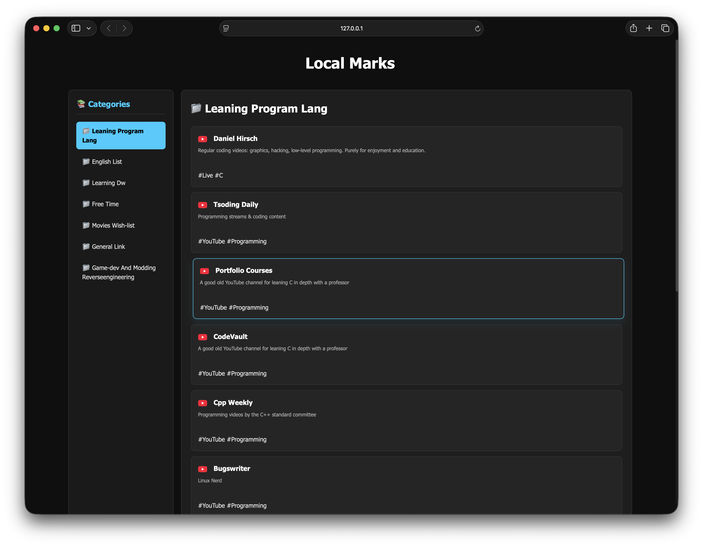

# LocalMarks

A simple, fast, and beautiful **local bookmark manager** that stores everything in plain text files.

No database. No cloud. Just your bookmarks, your way.



## ✨ Features

- Beautiful dark sidebar UI
- Automatic website favicons
- Categories from `.txt` files
- Fast search-ready (future)
- Fully local & private
- Easy to edit with any text editor


## 🚀 How to Use

### 1. Setup Bookmark Files

Create your bookmark folder:

```bash
mkdir -p ~/.local/share/bookmarks
```

Create `.txt` files inside it. Example:

**`Development.txt`**
**Format:**
```
Title | URL | Description | #tag1 #tag2
```

```txt
VS Code  | https://code.visualstudio.com | Best code editor   | #editor #tool
GitHub   | https://github.com            | Code hosting       | #git #code
Node.js  | https://nodejs.org            | JavaScript runtime | #javascript #backend
```

### 2. Generate Bookmarks

Run this command every time you add or edit bookmarks:

```bash
node generate-bookmarks.js
```

### 3. Open in Browser

- Open `index.html` using **Live Server** (recommended), or
- Double-click the file

## 🛠 Commands

| Command                        | Purpose                              |
|-------------------------------|--------------------------------------|
| `node generate-bookmarks.js`  | Update bookmarks.json                |
| Open with Live Server         | Best way to view                     |

## 🎨 Customization

- Edit `stylesheet/style.css` for styling
- Change title in `index.html`
- Add your own favicon in `assets/fevicol/`

## 📌 Future Plans (Optional)

- Search functionality
- "All Bookmarks" view
- Export / Import
- PWA support

---

## Made with ❤️ by Pritam

**LocalMarks** — Your personal bookmark haven.
