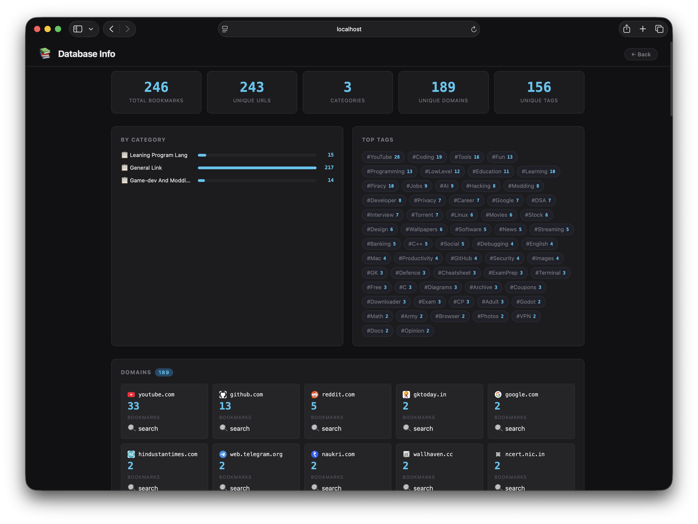

# 📚 LocalMarks

A fast, offline-first bookmark manager that runs entirely in your browser.
Write your bookmarks as plain `.txt` files, convert them to a JSON database with `marks2json`, and serve the viewer with one command.


---

## Table of Contents

- [How it works](#how-it-works)
- [Project structure](#project-structure)
- [Getting started](#getting-started)
- [Writing your .txt bookmark files](#writing-your-txt-bookmark-files)
- [marks2json — the converter](#marks2json--the-converter)
- [Running the viewer](#running-the-viewer)
- [Features](#features)
- [For developers](#for-developers)
- [Bonus — bookmarkfmt](#bonus--bookmarkfmt)

---

## How it works

```
your .txt files  ──►  marks2json  ──►  bookmarks.json  ──►  LocalMarks viewer
```

1. You keep bookmarks as human-readable pipe-separated `.txt` files
2. `marks2json` converts them into a structured `bookmarks.json` database
3. The static viewer (`index.html` + `info.html`) reads that JSON and renders everything in the browser
4. No backend, no database engine, no build step

---

## Project structure

```
LocalMarks/
├── assets/
│   ├── home_page.png
│   └── info_page.png
├── javascript/
│   ├── script.js          # Bookmark browser logic
│   └── info.js            # Database stats page logic
├── stylesheet/
│   └── style.css          # Shared styles for all pages
├── index.html             # Main bookmark browser
├── info.html              # Database stats & domain breakdown
├── bookmarks.json         # Generated by marks2json — place here
├── favicon.ico
└── README.md
```

---

## Getting started

> **Regular users:** download the latest release from the [Releases page](../../releases) — do not clone the repository. Cloning is for development only.

**1. Download the release**

Go to the [Releases page](../../releases) and download the latest `.zip`. Extract it.

**2. Install `marks2json`**

```bash
pip install requests
# then put marks2json.py somewhere on your PATH, e.g.:
cp marks2json.py ~/.local/bin/marks2json
chmod +x ~/.local/bin/marks2json
```

**3. Create your bookmark database**

```bash
marks2json create ~/bookmarks/*.txt -T bookmarks.json
```

Place the generated `bookmarks.json` next to `index.html`.

**4. Start the viewer**

```bash
cd LocalMarks/
python3 -m http.server 8085
```

Open [http://localhost:8085](http://localhost:8085) in your browser.

---

## Writing your .txt bookmark files

Each `.txt` file becomes one **category** in the viewer. The filename becomes the category name — underscores are replaced with spaces and each word is capitalised.

```
free_time.txt      →  "Free Time"
learning_python.txt  →  "Learning Python"
```

### Line format

Each bookmark is one line with fields separated by `|`:

```
title | url | description | tags
```

| Field | Required | Notes |
|---|---|---|
| `title` | no | Display name shown in the viewer |
| `url` | **yes** | Must contain `http://` or `https://` |
| `description` | no | Short note about the link |
| `tags` | no | Space-separated, each prefixed with `#` |

### Rules `marks2json` enforces

- A line **without** `http://` or `https://` is **skipped entirely**
- A line with **more than 3 pipe characters** (more than 4 columns) is **skipped entirely**
- Lines starting with `#` are treated as **comments** and skipped
- Empty lines are skipped

### Comments

Lines starting with `#` are ignored by `marks2json`, so you can use them freely as comments or section headers inside your files:

```
# ── Learning ────────────────────────────────
MDN      | https://developer.mozilla.org | Web platform docs | #Dev #Web
Python   | https://docs.python.org       | Python reference  | #Dev #Python

# ── YouTube channels ────────────────────────
Tsoding  | https://www.youtube.com/@tsoding | Live coding streams | #YouTube #C
```

### Full example — `free_time.txt`

```
# ── Games ───────────────────────────────────
akinator      | https://en.akinator.com          | Guess a celebrity     | #Game #Akinator
invisiblecow  | https://findtheinvisiblecow.com/ | Find the Invisible Cow | #Game

# ── Reading ──────────────────────────────────
oddee         | https://www.oddee.com/           | Random interesting stuff | #Blog #Read

# ── Misc ─────────────────────────────────────
earthcam      | https://www.earthcam.com         | Live cameras worldwide   | #Cam #Media
```

> **Tip:** keep one `.txt` file per topic. The filename is the category name, so name them clearly.

---

## marks2json — the converter

`marks2json` has two subcommands: `create` and `append`.

### Create a new database

```bash
# Single file
marks2json create free_time.txt -T bookmarks.json

# Multiple files
marks2json create *.txt -T bookmarks.json

# With YouTube channel icon fetching
marks2json create *.txt -T bookmarks.json --icon
```

### Append to an existing database

Use `append` when you add a new `.txt` file and don't want to rebuild from scratch. URLs already in the database are automatically skipped — no duplicates.

```bash
marks2json append new_category.txt -T bookmarks.json

# Multiple files
marks2json append tools.txt references.txt -T bookmarks.json
```

If the category name already exists in the database, new bookmarks are merged into it. If it's a new category, it's appended.

### All options

```
usage: marks2json {create,append} ...

subcommands:
  create   Build a fresh database from .txt files
  append   Add bookmarks to an existing database

shared options:
  FILE ...        One or more .txt bookmark files
  -T / --to DB    Output / target JSON file
  -Y / --icon     Fetch YouTube channel icons (requires internet)
```

### The JSON schema

```jsonc
{
  "book_Marks": [
    {
      "category": "Free Time",
      "bookmarks": [
        {
          "title": "akinator",
          "url": "https://en.akinator.com",
          "description": "Guess a celebrity",
          "tags": ["Game", "Akinator"],
          "domain": "en.akinator.com",
          "icon": "https://..."   // only present for YouTube channels with --icon
        }
      ]
    }
  ],
  "book_mark_domain_hash": { "en.akinator.com": 1, "oddee.com": 3 },
  "book_mark_tag_hash":    { "Game": 4, "Dev": 12 }
}
```

---

## Running the viewer

```bash
cd LocalMarks/
python3 -m http.server 8085
```

Then open **http://localhost:8085**

> The viewer must be served over HTTP — opening `index.html` directly as a `file://` URL will not work because browsers block `fetch()` on local files.

---

## Features

**Bookmark browser (`index.html`)**

- Sidebar with all categories and bookmark counts
- Full-text search across title, description, tags, and URL (`Ctrl+K` / `Cmd+K` to focus)
- Tag filter bar per category — click any tag pill to filter, multi-select supported
- Click a tag directly on a bookmark card to instantly add it to the filter
- Collapsible tag bar — automatically folds when a category has more than 20 tags, shows active filter count while folded
- Duplicate URLs are silently deduplicated within each category
- Favicons loaded via Google's favicon service, with a fallback chain for YouTube thumbnails

**Stats page (`info.html`)**



- Total bookmarks, unique URLs, categories, domains, and tags at a glance
- Per-category bar chart
- Tag cloud sorted by frequency (sourced directly from `book_mark_tag_hash`)
- Domain grid with favicon and count — click any domain card to jump straight to a filtered search for that domain on the main page

---

## For developers

Clone the repository and work directly:

```bash
git clone https://github.com/YOUR_USERNAME/LocalMarks.git
cd LocalMarks
python3 -m http.server 8085
```

Place your `bookmarks.json` next to `index.html` and the viewer picks it up automatically on reload.

**File responsibilities:**

| File | Purpose |
|---|---|
| `javascript/script.js` | Category sidebar, bookmark cards, search, tag filtering |
| `javascript/info.js` | Stats rendering, domain grid, tag cloud |
| `stylesheet/style.css` | All visual styles for both pages |
| `index.html` | Bookmark browser shell |
| `info.html` | Stats page shell |

---

## Bonus — bookmarkfmt

If you want your `.txt` files to stay neatly column-aligned (so they are easier to read and edit by hand), there is a companion formatter called **`bookmarkfmt`**.

It is not part of this repository. It lives in the author's dotfiles:

**[bookmarkfmt.py — pritam12426/dotfiles](https://github.com/pritam12426/dotfiles/blob/main/darwin/bin_scripts/bookmarkfmt.py)**

```bash
# Format one file in-place
bookmarkfmt free_time.txt

# Preview without writing
bookmarkfmt --dry-run *.txt

# CI / git pre-commit hook — exits with code 1 if any file needs formatting
bookmarkfmt --check *.txt
```

Before:
```
earthcam | https://www.earthcam.com | See random places | #Cam #Media
oddee | https://www.oddee.com/ | Read stuff | #Blog #Read
akinator | https://en.akinator.com | Guess celebs | #Game
```

After:
```
earthcam | https://www.earthcam.com | See random places | #Cam #Media
oddee    | https://www.oddee.com/   | Read stuff        | #Blog #Read
akinator | https://en.akinator.com  | Guess celebs      | #Game
```

---

## License

MIT
